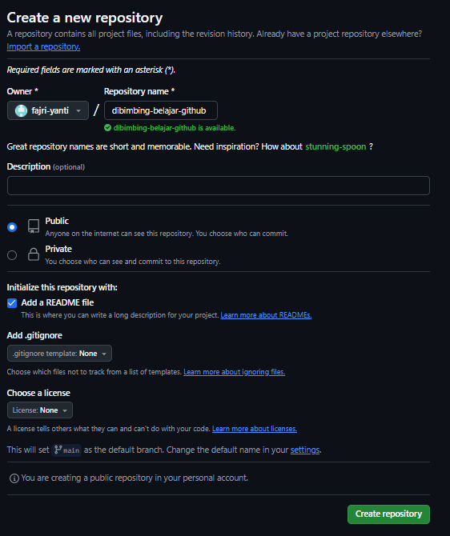
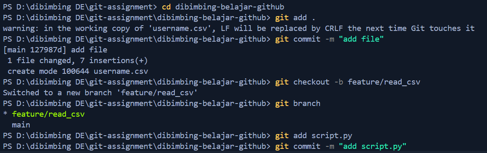
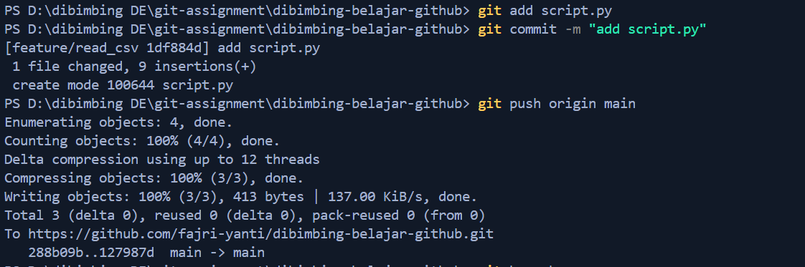

# dibimbing-belajar-github
1. Create repository

2. Clone repository
```bash
git clone https://github.com/fajri-yanti/dibimbing-belajar-github.git
```

3. Create script.py to read file
4. create branch feature/read_csv and commit to feature/read_csv
```bash
git branch #check branch
git checkout -b feature/read_csv
git add script.py
git commit -m "add script.py"
```

5. Push ke repository
```bash
git push origin main
```


