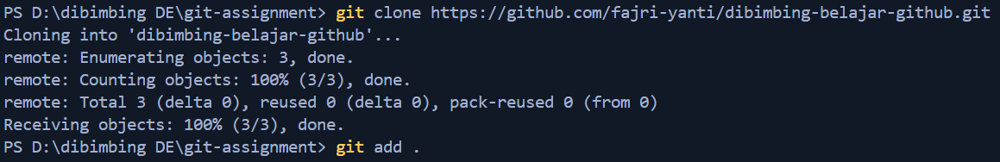
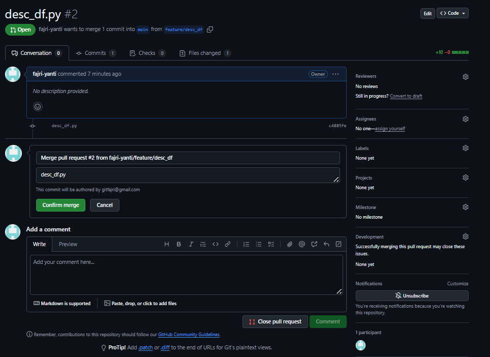
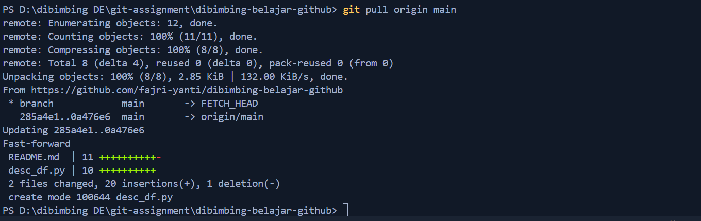

# dibimbing-belajar-github
1. Create repository
   


2. Clone repository
```bash
git clone https://github.com/fajri-yanti/dibimbing-belajar-github.git
```


3. Create script.py to read file

4. create branch feature/read_csv and commit to feature/read_csv
```bash
git branch #check branch
git checkout -b feature/read_csv
git add script.py
git commit -m "add script.py"
```


5. Push ke repository
```bash
git push origin main
```


6. Pull Request di Github untuk merge ke branch master/main




7. Pull remote master/main branch ke local main branch

